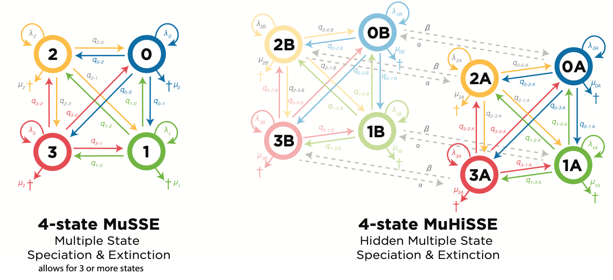

<!-- 
title: Hypothesis testing with the Multiple State-dependent Speciation and Extinction (MuSSE) and Multiple Hidden State-dependent Speciation and Extinction (MuHiSSE) models in RevBayes
subtitle: 
authors:  Jenna McCullough
level: 0
order: 2
index: true
redirect: false
include_files:
    - musse_muhisse/data/combined_traitdatabase_0123.tsv
    - musse_muhisse/data/MCC_AFRICANRESTIOS.tre
    - tutorial_structure/scripts/test.Rev
    - tutorial_structure/scripts/test.Rmd


---
-->

# Hypothesis testing with the Multiple State-dependent Speciation and Extinction (MuSSE) and Multiple Hidden State-dependent Speciation and Extinction (MuHiSSE) models in RevBayes


## Overview 
<!-- -->
The purpose of this tutorial is to give a detailed description of how to use Multiple State-dependent Speciation and Extinction (MuSSE) and Multiple Hidden State-dependent Speciation and Extinction (MuHiSSE) models to test specific hypotheses related to state-dependent diversification in RevBayes. Because the goal is to describe the critical thinking steps that goes into hypothesis testing with Bayesian SSEs, this tutorial also describes a case study for Restios (described in Zenil-Ferguson et al. XXXX) and the detailed interpretation of the output files. 

## Hidden States 
<!-- --->

To answer the question whether a trait of interest has an effect on diversification, it is imperative to reject the null hypothesis that it does not. If it does have an effect, a particular character state will have a result of higher net diversification, supporting a hypothesis of state-dependent diversification. If all rates are equal between states, that means that the trait in question has no effect on diversification and supports the null hypothesis. Caetano et al. (2018) described the null hypothesis of models that do not include hidden states (e.g., MuSSE and Binary Speciation and Extinction [BiSSE]) as  “one rate to rule them all”. But evolution varies so widely across time and space and numerous studies have shown that the “one rate to rule them all” hypothesis is often outperformed by one that incorporates even a small amount of complexity  (Rabosky and Goldberg 2015; O'Meara and Beaulieu 2016; Rabosky and Goldberg 2017; Alves et al. 2017). With the introduction of hidden state models (HiSSE; Beaulieu and O'Meara 2016), we have ability to test whether the trait of interest (observed state) or a “hidden state” influences diversification, thereby allowing for a more robust null model in which to test for state-dependent speciation.

Another way of describing hidden state models is "complexity that we add" in order to see if our data still supports a hypothesis of state dependent diversification. 

## The Models 
<!-- --->

MuSSE departs from the BiSSE model by allowing for three or more states in which to test hypotheses about state-dependent diversification. MuHiSSE is the model extension of the MuSSE model by its addition of a hidden state. These models incorporate more than two states; we show four states below. These states can represent different kinds of traits, whether it be phenotypic, geographic, or otherwise. Examples could be three different colors of petals (red, blue, purple) or a combination of two binary traits together. 


<!---

--->
Figure 1. Differences in the number of states and parameters between MuSSE and MuHiSSE models. MuHiSSE has double the states of a MuSSE because of the hidden state versions (A and B). 
<!---
--->

In both models, each state has its own speciation (λ, lambda) and extinction (μ, mu) parameters as well as anagenetic transitions between states (q) that occur between speciation events. MuHiSSE additionally has parameters that govern the transitions between the A and B states (alpha and beta). It is important to mention here that, similar to BiSSE and  Hidden State Speciation and Extinction (HiSSE), these models only allow for a trait change to occur along a branch (anagenetic trait evolution, denoted by the q transition parameters) rather than at a speciation event (cladogenetic trait evolution). If this is something you would like to implement in your own work, see the Cladogenetic Speciation and Exinction (ClaSSE, Goldberg and Igic 2012).

In RevBayes, it is simple to control the q transition matrix if your own empirical system required it. For example, if it was biologically unrealistic for an anagenetic transition to occur from state 0 to state 2, it would be possible to set the transition matrix to only allow transitions into state two from either state 1 or 3. This is discussed more below.

In this tutorial, we will not be going through the step by step guide for MuSSE because taking the time to perform their more complex, hidden state extensions in a Bayesian framework inherently includes their more simpler versions. In other words, we can interpret results from only the A states (0A, 1A, 2A, and 3A) from the MuHiSSE if we wanted to know the results of a non-hidden state model. But by running the more complex model in RevBayes, we have the information for both and the confidence that our results will be less likely to be hampered by false positive inferences. But the code to do a  MuSSE nonetheless will be available in `musse.rev`. Overall, its code is not significantly different but there are more parameters because there are twice as many states (Figure 1). 

## Tensorphylo
<!------>

Because Bayesian SSE models are computationally intensive, especially for large trees, TensorPhylo is a program that can improve computational time. Because it might be impractical for some users to implement TensorPhylo, we have versions of this tutorial with and without Tensorphylo.

NOTE: should we just include the bit about Tensorphylo at the bottom of the tutorial instead? 

## Testing Diversification Hypotheses and Workflow
<!------>

SSE models are powerful methods to explore the relationship of traits to the tempo and mode of evolution. To use them most effectively, we need to have specific hypotheses that can only come from understanding the biology of your study system. 

The data we will be analyzing for this tutorial is the same as discussed in Zenil-Ferguson et al. (XXXXXXX): a reanalyzed dataset of restios (Polaes: Restionaceae from Bouchenak-Khelladi and Linder 2017), which are a family of bamboo-like flowering plants mostly found in the Cape Floristic Region of South Africa. Bouchenak-Khelladi and Linder (2017) sought to understand how two binary habtiat traits, precipitation (dry or wetlands) and elevation (costal or mountainous), contribute to faster rates of diversification. They also combined these two traits into four states for a MuSSE model (coastal dryland, coastal wetlands, mountainous drylands, and mountainous wetlands), which is what we will be running in this tutorial. 

They had two hypotheses about what contributed to higher diversification:

1. The older mountainous wetland habitats are more fragmented and have promoted lineage diversification because of higher rates of turnover.

2. The recent coastal dryland habitats have had much more connectivity and geographic area in which to diversify.

The authors fitted BiSSE, HiSSE, ClaSSE, and MuSSE in the R packages hisse and diversitree, both likelihood methods, and determined the best model with the Akaike Information Criterion (AIC; See the likelihood workflow below). When considering elevation and precipitation independently (BiSSE, HiSSE, and ClaSSE), Bouchenak-Khelladi and Linder (2017) found no relationship with net diversification for either trait. When they combined the traits in a 4-state MuSSE model, the best-fit model was the one that had the same speciation but different extinction rates. Overall, Bouchenak-Khelladi and Linder (2017) concluded that no habitat category had higher net diversification rates, thus not supporting their original hypotheses.


<!---
<# img src="figures/likelihood-bayesian-comparison.png" width="600">

This is a simplified workflow for implementing Likelihood vs. Bayesian SSE model 

---> 


Instead of running a MuHiSSE model in which we set expectation for rates (i.e., the difference in the models A–D in the workflow figure above), we will analyze one model, a MuHiSSE allowing with free rates. 

## Data preparation
<!------>

This tutorial uses RevBayes v1.2.5. Earlier versions may not run properly. 

Begin by creating a project _directory_ (also referred to as a folder) on your computer, titled `musse` with two subdirectories inside, one called _data_ and the other called _scripts_. See the box called `Data files and scripts` in the upper left-hand corner of this webpage and download the files. Put `combined_traitdatabase_0123.tsv` and `MCC_AFRICANRESTIOS.tre` into your _data_ directory and `test.Rev` and `test.Rmd` into your _scripts_ directory.

We are first going to go line by line through `muhisse.Rev` and then we will interpret the results in R using `muhisse.Rmd`. 

## MuHiSSE in RevBayes 
By combining our two binary traits into four states, we have four options for states in our trait dataset. 
```
# 0 = Wet Coast
# 1 = Wet Montane
# 2 = Dry Coast
# 3 = Dry Montane
```
This dataset does not have 'widespread' species, meaning that each species occurs in only one state, but it is possible to code this in the trait matrix. 
```
# If we needed to have species occur in multiple states or add uncertainty 
# Species_A occurs in wet montane and wet coasts: (0 1)
# species_B occurs in all habitats: (0 1 2 3)
# species_C occurs in both wet and dry habitats in mountains: (1 3)
# species_D does not have known habitat data: ? 
``` 

### Setting basic settings and loading in the data 
First, we set some basic settings and provide the number of states that you will have in your model. Here, we have four states (0–3) and two hidden states (A and B). If you wanted to change the total number of states (i.e., a 3-state MuHiSSE etc.) or include more than two hidden states (i.e., C and D hidden states), this is where you would define this in the code. 

```
setOption("useScaling","true")
NUM_STATES = 4
NUM_HIDDEN = 2
NUM_RATES = NUM_STATES * NUM_HIDDEN
```
Load in your tree and trait data. Note that this phylogeny does not have outgroups that are typically required during phylogenetic tree estimation. Dropping outgroups from macroevolutionary analyses is important because it limits extreme sampling bias that could impact this analysis' overall conclusions about rates of diversification. 
  
```
observed_phylogeny <- readTrees("data/MCC_AFRICANRESTIOS.tre")[1]
data <- readCharacterDataDelimited("data/combined_traitdatabase_0123.tsv",stateLabels=4,type="NaturalNumbers",delimiter="\t",header=FALSE)
```

Our trait file `combined_traitdatabase_0123.tsv` only has states coded as 0, 1, 2, or 3. This would be fine if we were doing a typical MuSSE (See figure 1). But to get them expanded across hidden states (i.e., 0A, 0B, etc.) in order to 'add complexity' to have better null hypotheses to test against, we need to expand our matrix: 
```
data_exp <- data.expandCharacters( NUM_HIDDEN )
```

Now we will set up the move and monitor indicies for the MCMC. We also define H, which describes the the standard deviation of the prior probability (See Höhna et al. 2017 for more details). 
```
# set my move index
mvi = 0
mni = 0
H = 0.587405
```

### Defining the rates 

First we will specify a prior on our diversification and transition rate. 

These rates will be unique to your study system based on total diversity and total age of the group. For our restio dataset, there are 340 species total (not the number of species present in our phylogenetic tree, which is not 100% complete). The root age of the group is dependent on the time-calibrated phylogeny we loaded in earlier. We set our standard deviation with our H parameter from above.

```
rate_mean <- ln( ln(340/2.0) / observed_phylogeny.rootAge() )
rate_sd <- 2*H

```

Using our total number of states (8: four A and four B states) and our just defined `rate_mean` and `rate_sd` priors, we will first define priors with normal distributions for our speciation and extinction rates for our observed states and then assign how liberal we will allow our MCMC proposals to move (the weight value). 

```
for (i in 1:NUM_STATES) {
speciation_alpha[i] ~ dnNormal(mean=rate_mean,sd=rate_sd)
moves[++mvi] = mvSlide(speciation_alpha[i],delta=0.20,tune=true,weight=3.0)

extinction_alpha[i] ~ dnNormal(mean=rate_mean,sd=rate_sd)
moves[++mvi] = mvSlide(extinction_alpha[i],delta=0.20,tune=true,weight=3.0)

}
```
Then we do the same thing for our hidden states. 

```
for (i in 1:NUM_HIDDEN) {
speciation_beta[i] ~ dnExp(1.0)
moves[++mvi] = mvScale(speciation_beta[i],lambda=0.20,tune=true,weight=2.0)
extinction_beta[i] ~ dnNormal(0.0,1.0)
moves[++mvi] = mvSlide(extinction_beta[i],delta=0.20,tune=true,weight=2.0)
}
```

Then we combine the observed (A states) and hidden (B states) to construct a full bector of speciation and extinction rates. 

```
for (j in 1:NUM_HIDDEN) {
  for (i in 1:NUM_STATES) {
    if ( j == 1) {
      speciation[i] := exp( speciation_alpha[i] )
      extinction[i] := exp( extinction_alpha[i] )
    } else {
      index = i + (j * NUM_STATES) - NUM_STATES
      speciation[index] := speciation[index - NUM_STATES] * exp( speciation_beta[j - 1] )
      extinction[index] := exp( extinction_alpha[i] + extinction_beta[j - 1] )
    }
  }
}
```

### Setting up the anagenetic transition rates (Q Matrix)
The Q matrix governs the rate of transitions between states. These are anagenetic transitions, meaning that they occur between speciation rates and therefore along a branch. We need to have a broad shape parameter to define the rate of the gamma distribution for our state transitions. 
```
shape_pr := 0.5
```

For our rate parameter, we can give a general estimate of transitions across the tree. Here, we are defining the transition rates between states as drawn from an gamma distribution with a mean of 10 state transitions over the tree. 

```
rate_pr := observed_phylogeny.treeLength()/10
 ```

Next, we will assign prior rates for each transition between the four observed states. For each rate, we will also set its MCMC proposal moves. A smaller weight is more conservative. Note that here, there is no differentiation between hidden states. 

```
rate_01 ~ dnGamma(shape=shape_pr, rate=rate_pr) # Wet Coast to Wet Montane
moves[++mvi] = mvScale( rate_01, weight=2 )
rate_10 ~ dnGamma(shape=shape_pr, rate=rate_pr) # Wet Montane to Wet Coast
moves[++mvi] = mvScale( rate_10, weight=2 )

rate_03 ~ dnGamma(shape=shape_pr, rate=rate_pr) # Wet Coast to Dry Montane
moves[++mvi] = mvScale( rate_03, weight=2 )
rate_30 ~ dnGamma(shape=shape_pr, rate=rate_pr) # Dry Montane to Wet Coast
moves[++mvi] = mvScale( rate_30, weight=2 )

rate_02 ~ dnGamma(shape=shape_pr, rate=rate_pr) # Wet Coast to Dry Coast
moves[++mvi] = mvScale( rate_02, weight=2 )
rate_20 ~ dnGamma(shape=shape_pr, rate=rate_pr) # Dry Coast to Wet Coast
moves[++mvi] = mvScale( rate_20, weight=2 )

rate_12 ~ dnGamma(shape=shape_pr, rate=rate_pr) # Wet Montane to Dry Coast
moves[++mvi] = mvScale( rate_12, weight=2 )
rate_21 ~ dnGamma(shape=shape_pr, rate=rate_pr) # Dry Coast to Wet Montane
moves[++mvi] = mvScale( rate_21, weight=2 )

rate_13 ~ dnGamma(shape=shape_pr, rate=rate_pr) # Wet Montane to Dry Montane
moves[++mvi] = mvScale( rate_13, weight=2 )
rate_31 ~ dnGamma(shape=shape_pr, rate=rate_pr) # Dry Montane to Wet Montane
moves[++mvi] = mvScale( rate_31, weight=2 )

rate_23 ~ dnGamma(shape=shape_pr, rate=rate_pr) # Dry Coast to Dry Montane
moves[++mvi] = mvScale( rate_23, weight=2 )
rate_32 ~ dnGamma(shape=shape_pr, rate=rate_pr) # Dry Montane to Dry Coast
moves[++mvi] = mvScale( rate_32, weight=2 ) 

```
Create a vector for Q matrix and have all the initial values be zero. If you change the number of states for your model from four to something else, you will also need to change the dimensions of this matrix as well. 

```
for (i in 1:4) {
  for (j in 1:4) {
    q[i][j] := 0.0
  }
}
```

Now we will fill in our Q matrix with rates that we just defined. Now, up to this point, we have been using the numbers 0 – 3 to reference our states (wet coast, etc.). Below, the Rev language requires us to start with a "1" rather than a "0". 

That conversion looks like this: 
```

# state 0 in our model = 1 in rev code here = Wet Coast
# state 1 in our model = 2 in rev code here = Wet Montane
# state 2 in our model = 3 in rev code here = Dry Coast
# state 3 in our model = 4 in rev code here = Dry Montane
```
Here is how we input our newly defined prior rates into the Q matrix. 

```
q[1][2] := rate_01 # transition from Wet Coast to Wet Montane
q[2][1] := rate_10 # transition from Wet Montane to Wet Coast
q[1][4] := rate_03 # transition from Wet Coast to Dry Montane
q[4][1] := rate_30 # transition from Dry Montane to Wet Coast
q[1][3] := rate_02 # transition from Wet Coast to Dry Coast
q[3][1] := rate_20 # transition from Dry Coast to Wet Coast
q[2][3] := rate_12 # transition from Wet Montane to Dry Coast
q[3][2] := rate_21 # transition from Dry Coast to Wet Montane
q[2][4] := rate_13 # transition from Wet Montane to Dry Montane
q[4][2] := rate_31 # transition from Dry Montane to Wet Montane
q[3][4] := rate_23 # transition from Dry Coast to Dry Montane
q[4][3] := rate_32 # transition from Dry Montane to Dry Coast
```

In your own empirical system, this would be one area in the code that you would tailor to suit your own model's needs. For example, if you did not think it would ever be biologically realistic for a transition between observed states 0 and 3, you could force this by not assigning a rate above nor would you change the the Q matrix from its original value of 0 (meaning that the event could not happen). 

It would be the same as stating this.  
```
# if you did not want to allow the transition between wet coast to dry montane: 
q[1][4] := 0 # means that there is no chance of transition directly from Wet Coast (0) to Dry Montane (3) habitats. 
``` 

### Setting up the transition rate matrix for hidden states 
We are assuming that the transitions among the hidden states are all equal and drawn from an exponential distribution from the same rate. 
```
hidden_rate1 ~ dnExponential(rate_pr)
moves[++mvi] = mvScale(hidden_rate1,lambda=0.2,tune=true,weight=5)
hidden_rate2 ~ dnExponential(rate_pr)
moves[++mvi] = mvScale(hidden_rate2,lambda=0.2,tune=true,weight=5)
```

Here, hidden rate 1 is alpha from the model at the top of this tutorial, governing the transitions between A states to B states. Hidden rate 2 is beta, describing the rate of transitions between B states to A states. 

Now we put these rates into our R matrix to define which rate goes to which transition. 
```
R[1]:= hidden_rate1
R[2]:= hidden_rate2
R[3]:= hidden_rate1
R[4]:= hidden_rate2
```
With all of our rates created and defined into their respective matrices, we can combine them into the full transition matrix. 
```
rate_matrix := fnHiddenStateRateMatrix(q, R, rescaled=false)
```

### Setting up the root state frequencies and finalizing the model 
To set the root state frequencies, we are going to create a constant variable with the prior probabilities of each rate category at the root of the phylogeny with a Dirichlet distribution. 
```
rate_category_prior ~ dnDirichlet( rep(1,NUM_RATES) )
```
Next we will set the moves for this, which requires a special move because they are drawn from a Dirichlet distribution. 

```
moves[++mvi] = mvBetaSimplex(rate_category_prior,tune=true,weight=2)
moves[++mvi] = mvDirichletSimplex(rate_category_prior,tune=true,weight=2)
```
From our tree file, we need to extract the root age, also known as the tree height.   
```
root <- observed_phylogeny.rootAge()
```
Lastly, we need to state the sampling fraction of our phylogeny. The phylogenetic tree is 98% completely sampled, making the probability of sampling species at the present be: 
```
rho <- 0.98
```
Now that we have all of our rates set, we can create a stochastic variable that describes state-dependent birth, death, and speciation processes. The _dnCDBDP_ distribution, which is named for a character-dependent birth-death process (also known as a state-dependent speciation and extinction process), sets the interacting processes that generate a tree with a topology, divergence dates, and the trait states at the tips. Though we have  specifically created several some of these variables (i.e., speciation, extinction, rate_matrix, rate_category_prior) or are aspects of our empirical phylogeny (i.e., root, rho), there are some that we need to define in order to compute the model likelihood. The _condition_ arugment instructs the model what the units of time are for our rootAge setting. 
```
muhisse ~ dnCDBDP(
rootAge           = root,
speciationRates   = speciation,
extinctionRates   = extinction,
Q                 = rate_matrix,
pi                = rate_category_prior,
rho               = rho,
delta             = 1.0,
condition         = "time" )

```

Because MuHiSSE jointly models the tree and trait evolution, we need to clamp our newly created stochastic variable with the fixed topology and modern trait states. In doing so, it will allow us to infer the model parameters using our empirical data. 
```
muhisse.clamp( observed_phylogeny )
muhisse.clampCharData( data_exp )
```
### Setting up the MCMC and running the analysis
Next we make a model wrapper by selecting one of the parameters. Because `rate_matrix` is clamped with all other model parameters, selecting it to initialize the model will pull all other parameters that are directly or indirectly connected to `rate_matrix` will include them into the model as well. 
```
mymodel = model(rate_matrix)
```
Now we will set up the monitors. We want the MCMC to track different parameters while it runs. First, we want to save model parameters to a file using `mnModel` and set frequency of writing output to a log file (_printgen_). We also want to print some output to the screen so we can quickly know what generation the analysis is on using `mnScreen`. We are saving our output files in a directory called `output`. 

```
monitors = VectorMonitors()
monitors.append(mnModel(filename="output/muhisse.log", printgen=10)) #this is the number of generations that you will record. 
monitors.append(mnScreen(printgen=10, q, R, speciation, extinction)) 
```
If you want to do ancestral state reconstruction, we also want to save states (`mnJointConditionalAncestralState`) and stocastic character mappings (`mnStochasticCharacterMap`). However, when adapting this tutorial for your own purposes, you might not be interested in ancestral state reconstruction and not including it in your analysis would save computational time. 
```
monitors.append(mnJointConditionalAncestralState(tree=muhisse, cdbdp=muhisse, type="NaturalNumbers", printgen=1, withTips=true, withStartStates=false, filename="output/anc_states_muhisse.log"))
monitors.append( mnStochasticCharacterMap(cdbdp=muhisse,printgen=1,filename="output/stochmap_muhisse.log", include_simmap=true))
```

Set your MCMC and specify the number of chains you would like to simultaneously run. Here, _nruns_ is set to two chains so we can check for convergence. 
```
mymcmc = mcmc(mymodel, monitors, moves, nruns=2, moveschedule="random")
```
You can set your pre-burnin to tune the proposals prior to the analysis starting. Alternatively, these could be dropped after the analysis is complete. 
```
mymcmc.burnin(generations=15000,tuningInterval=100)
```
Finally, you can run the analysis. There are multiple ways to do this. If you don't want checkpointing to occur, start it like this:  
```
mymcmc.run(generations=150000)
```
If you DO want checkpointing to occur, use this code _instead_ of the line above. 
```
# When the analysis needs to be restarted from a checkpoint file, uncomment this line below. It is important that this line preceeds mcmc.run.  
#mymcmc.initializeFromCheckpoint("output/muhisse.checkpoint_run_1.txt") #comment out for first run. This will be dependent on whether you are restarting the first (run_1) or second (run_2) chain. 
mymcmc.run(generations=150000, checkpointFile="output/muhisse.checkpoint.txt", checkpointInterval=100)
```

### Summarize the ancestral states

```
anc_states = readAncestralStateTrace("output/anc_states_muhisse_run_1.log")

anc_tree = ancestralStateTree(tree=observed_phylogeny, ancestral_state_trace_vector=anc_states, include_start_states=false, file="output/anc_states_summary_muhisse_run_1.tree", burnin=15000, summary_statistic="MAP", reconstruction="marginal")

anc_state_trace = readAncestralStateTrace("output/stochmap_muhisse_run_1.log")
characterMapTree(observed_phylogeny, anc_state_trace, character_file="output/stochmap_muhisse_run_1.tree", posterior_file="output/posterior_muhisse.tree", burnin=50, reconstruction="marginal")

q()
``` 

